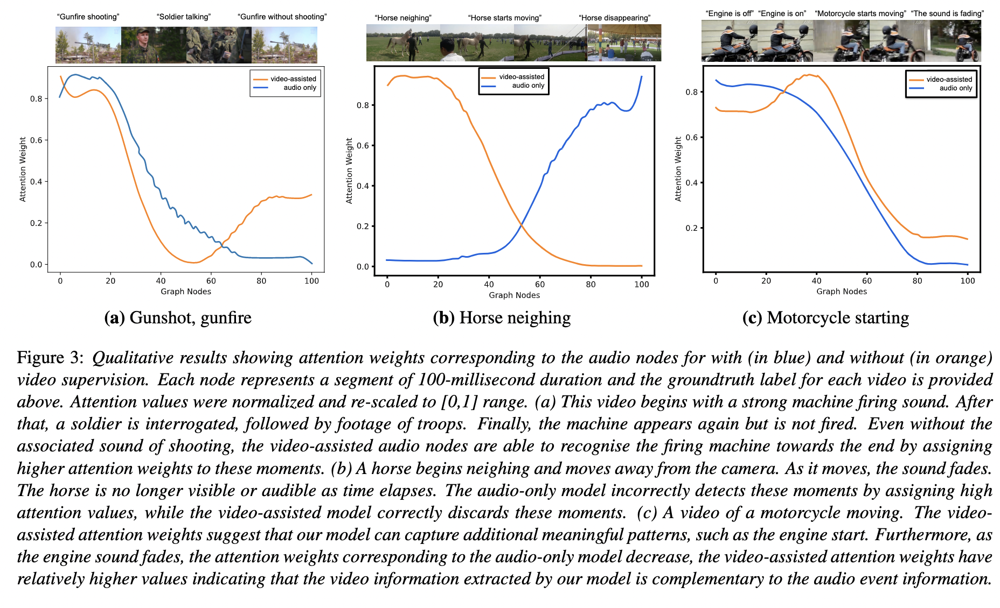

# Visually-aware Acoustic Event Detection using Heterogeneous Graphs

<br>

**Jun 26, 2022**
* First release of the project.

<br>


In this project, we employ heterogeneous graphs to explicitly capture the spatial and temporal relationships between the modalities and represent detailed information of the underlying signal. Using heterogeneous graph approaches to address the task of visually-aware acoustic event classification, which serves as a compact, efficient and scalable way to represent data in the form of graphs. Through heterogeneous graphs, we show efficiently modeling of intra- and inter-modality relationships both at spatial and temporal scales. Our model can easily be adapted to different scales of events through relevant hyperparameters.
## Dependency installation

The code was successfully built and run with these versions:

```
pytorch-gpu 1.11.0
cudatoolkit 11.3.1
pytorch_geometric 2.0.4
opencv 4.6.0.66
scikit-learn 1.0.2

```
Note: You can also create the environment I've tested with by importing _environment.yml_ to conda.


<br>

## Preprocessing Data

The AudioSet dataset is downloaded using this [repository](https://github.com/AmirSh15/AudioSet_downloader). For feature extraction part, [CoCLR](https://github.com/TengdaHan/CoCLR) (only need to put _CoCLR-ucf101-rgb-128-s3d-ep182.tar_ pretrained model in _pretrained_models_ directory) and [VGGish](https://github.com/harritaylor/torchvggish) (need to installed separately) is employed for video and audio correspondigly. 
For feature extraction, use code in _utils/Feature_ext.py_ and _Merge_extracted_features.py_.

Note: you can download the processed data from [here](https://drive.google.com/file/d/1_3H_wByS-cSLLG7vrhgfvdzCnjaXJ2ui/view?usp=sharing) and put in this directory:

```
/data/
  AudioSet/
    train/
        Output_clip_len_0.25_audio_101/
            AudioSet_embedds_A capella.h5
            AudioSet_embedds_Accelerating, revving, vroom.h5
            ...
    eval/
        Output_clip_len_0.25_audio_101/
            AudioSet_embedds_A capella.h5
            AudioSet_embedds_Accelerating, revving, vroom.h5
            ...
```


<br>

## Training

This code is written using [detectron2](https://github.com/facebookresearch/detectron2). You can train the model with running main.py . 
You can config the model and training parameters in _configs/AudioSey.yaml_.

```
MODEL:
  META_ARCHITECTURE: "HeteroGNN"
  AUDIO_BACKBONE:
    NAME: "Vggish"
    PRETRAINED_ON: ""
  VIDEO_BACKBONE:
    NAME: "CoCLR"
    PRETRAINED_ON: ""
  IMAGE_BACKBONE:
    NAME: "Resnext"
    PRETRAINED_ON: "ImageNet"
  HIDDEN_CHANNELS: 512
  NUM_LAYERS: 4
TRAINING:
  LOSS: "FocalLoss"
GRAPH:
  DYNAMIC: False
#  SPAN_OVER_TIME_AUDIO: 5
#  AUDIO_DILATION: 3
#  SPAN_OVER_TIME_VIDEO: 3
#  VIDEO_DILATION: 2
#  SPAN_OVER_TIME_BETWEEN: 6
  SPAN_OVER_TIME_AUDIO: 6
  AUDIO_DILATION: 3
  SPAN_OVER_TIME_VIDEO: 4
  VIDEO_DILATION: 4
  SPAN_OVER_TIME_BETWEEN: 3
  NORMALIZE: False
  SELF_LOOPS: False
  FUSION_LAYERS: []
DATASETS:
  TRAIN_RATIO: 0.7
  EVAL_RATIO: 0.1
  TEST_RATIO: 0.2
#  TRAIN_PATH: 'data/AudioSet/train/Output_clip_len_1.0_audio_10/AudioSet_embedds_all.h5'
  TRAIN_PATH: 'data/AudioSet/train/Output_clip_len_0.25_audio_101/AudioSet_embedds_all.h5'
  TEST_PATH: 'data/AudioSet/eval/Output_clip_len_0.25_audio_101/AudioSet_embedds_all.h5'
#  TEST_PATH: 'data/AudioSet/eval/Output_clip_len_1.0_audio_10/AudioSet_embedds_all.h5'
TEST:
  MAX_PATIENCE: 5
  EVAL_PERIOD: 250
DATALOADER:
  BATCH_SIZE: 32
  STRATIFIED_SPLIT: True
SOLVER:
  BASE_LR: 0.005
#  STEPS: (1500, 3200)
  STEPS: ()
  MAX_ITER: 100000
  WARMUP_ITERS: 1000
INPUT:
  MIN_SIZE_TRAIN: (640, 672, 704, 736, 768, 800)
VERSION: 0
SEED: 1
```

<br>

## Reference 

[//]: # ([ArXiv's paper]&#40;https://arxiv.org/pdf/2008.02063&#41;)
```
@inproceedings{shirian2022visually,
  title={Visually-aware Acoustic Event Detection using Heterogeneous Graphs},
  author={Shirian, Amir, Somandepalli, Krishna, Sanchez, Victor,  and Guha, Tanaya},
  booktitle={Proc. Interspeech 2022},
  year={2022}
}
```


<br><br><br>
